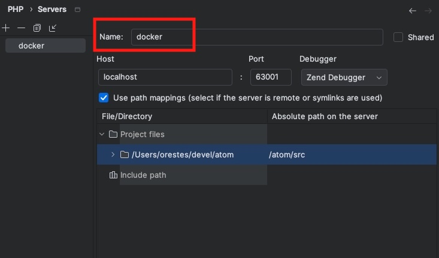
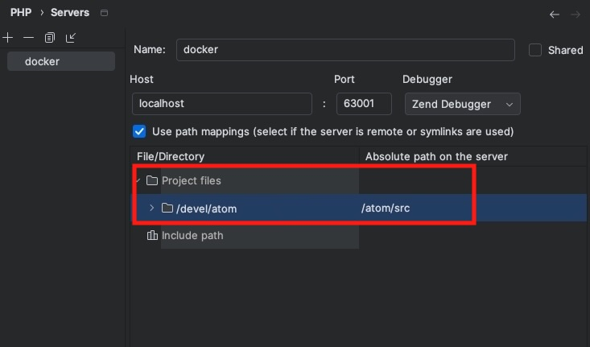

# [Access to Memory](https://www.accesstomemory.org)

Developed and maintained by [Artefactual Systems](https://www.artefactual.com/)

AtoM (short for Access to Memory) is a web-based, open source application for
standards-based archival description and access. The application is
multilingual and multi-repository. First commissioned by the International
Council on Archives ([ICA](https://www.ica.org)) to make it easier for
archival institutions worldwide to put their holdings online using the ICA’s
descriptive standards, the project has since grown into an internationally
used community-driven project. Learn more at:

* https://www.accesstomemory.org

You are free to copy, modify, and distribute AtoM with attribution under the
terms of the AGPLv3 license. See the [LICENSE](LICENSE) file for details.

## Installation

**Production installation**

AtoM is intended to be installed using a Linux-based operating system. We use
Ubuntu LTS releases in development and testing, but users have successfully
installed on other distributions as well.

* [Linux installation guides](https://www.accesstomemory.org/docs/latest/admin-manual/installation/ubuntu/)

For other O/S installs, we recommend virtualization.

**Development environments**

If you want to install a local copy of AtoM for testing and/or development, we
maintain two development environments:

* [Docker](https://www.accesstomemory.org/docs/latest/dev-manual/env/compose/)
* [Vagrant](https://www.accesstomemory.org/docs/latest/dev-manual/env/vagrant/)

## Other resources

* [Website](https://www.accesstomemory.org) - the home of the AtoM project!
* [Documentation](https://www.accesstomemory.org/docs/latest/) - where you'll
  find our User, Administrator, and Developer manuals. We version our manuals
  for each major release.
* [Wiki](https://wiki.accesstomemory.org/) - community and project resources,
  development documentation, release notes, and more.
* [User Forum](https://groups.google.com/forum/#!forum/ica-atom-users) - Forum
  and mailling list for user questions (both technical and end-user),
  discussion, and more.
* [SlideShare](https://www.slideshare.net/accesstomemory) - where we upload
  all the slide decks from our conference presentations and training camps!
* [Paid support](https://www.artefactual.com/services/): Paid support,
  hosting, training, theming, data migrations, consulting, and software
  development contracts from Artefactual.

## Contributing

Thank you for your interest in contributing to the AtoM project! 

Please see our [contributing guidelines](CONTRIBUTING.md) file for more information.

## Additional features

### Image conversion

Allow configuration of derivative density, quality and memory used for the subprocess. Setting is available in the GUI, on the `Uploads` tab of the `Settings` page.

* Density of media conversion in dpi, reduce it to reduce quality. Default `150`
* Derivatives quality: Quality of derivatives, a number from 1 to 100, the higher the number, the better the quality, but large derivative files. Default `90`
* Memory limit for the media conversion subprocess. Increase it if you get memory errors during conversion. Use suffixes like MB, GB, or KiB, MiB, GiB to specify the unit. default `500M`.


### Default timezone

Set it up on the `config/app.yml` file, in the `all` section.

### Slugs with international characters

Allowing a new configuration setting to use a different strategy to generate slugs, more suitable for international users.

It adds a new option on `Global settings > Permalink`, that allows replacing accented chars like á, é with ASCII chars a, e.

It uses the `intl` PHP module, and thus it requires some changes on building docker images.

Automatically detect if the `intl` PHP extension is available; if not, the new option will be hidden.

Transliteration is done using the `intl` function `transliterator_transliterate`, which supports different character mappings. This mapping is configurable, with a default provided. Setting is `app_intl_transliterate`, default value `Any-Latin;Latin-ASCII;`.

### Treeview sidebar

Fix the rendering of the treeview sidebar, when the sidebar is collapsed.

On the main branch, results show duplicated or unconsistently unordered. This feature makes sure the sort is consistent, and the sidebar is always rendered in the same order.

In addition, the render of the treeview allows identifying all the parts of a record: description level, status, title and identifier.

### Fix check path and import of digital objects

Fix the import path of digital objects.

When importing digital objects, the path was not correctly set, and thus the import failed. It also solves the import check of digital object paths, which was not working.

### Allow deleting settings from CLI

The CLI now allows deleting settings.

### Remove compoound digital objects navigation

Remove the navigation of compound digital objects, which was not working properly. In fact, as per [AtoM support team advice](https://groups.google.com/g/ica-atom-users/c/ctBZRctYi-I/m/lwoelx7NAAAJ) it is deprecated.

### Custom header colour

Allow a

### XDebug

To configure xdebug support on PHPStorm, follow [this guide](https://medium.com/the-sensiolabs-tech-blog/how-to-use-xdebug-in-docker-phpstorm-76d998ef2534).

Add the following to the `docker-compose.yaml` file:
```yaml
services:
  atom:
    extra_hosts:
      host.docker.internal: host-gateway
    environment:
      - PHP_IDE_CONFIG=serverName=docker  
```

Add a server configuration in PHPStorm and set the `name` to the `serverName` in the `docker-compose.yaml` file:



Make sure the mapping is properly set:




Add the following to the docker `xdebug.ini` file:
```ini
zend_extension=xdebug.so
xdebug.mode=debug
xdebug.client_host=host.docker.internal
xdebug.client_port=9003
xdebug.start_with_request=no
xdebug.log=/tmp/xdebug.log
xdebug.log_level=7
xdebug.idekey=PHPSTORM
xdebug.discover_client_host=false
```
